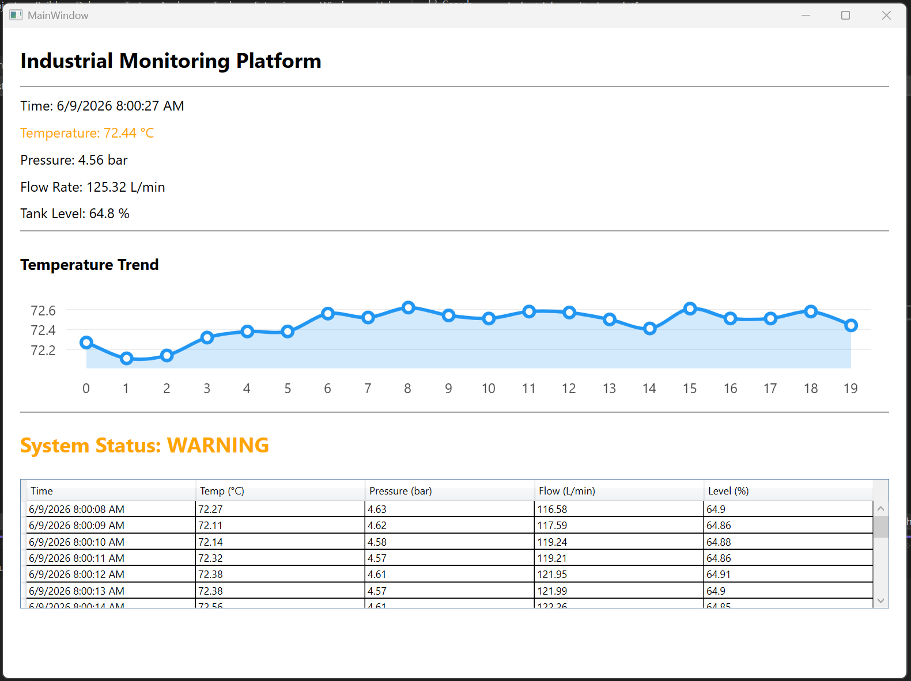

# industrial-monitoring-platform
Plateforme de supervision industrielle développée en C# et .NET 8 avec WPF pour la visualisation temps réel de capteurs, la gestion d'alarmes et l'enregistrement de données.

Pour que ça tourne:
dans le NuGet manager de Visual Studio, installer le package LiveChartsCore.SkiaSharpView.WPF
puis Build and Run

## Capture d'écran du dashboard:

